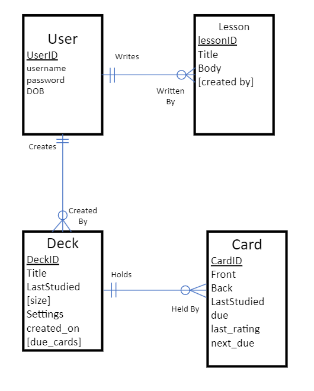
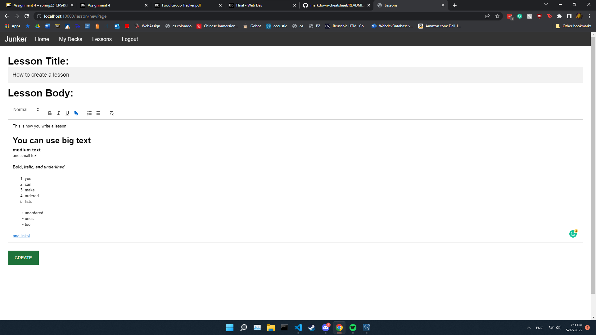
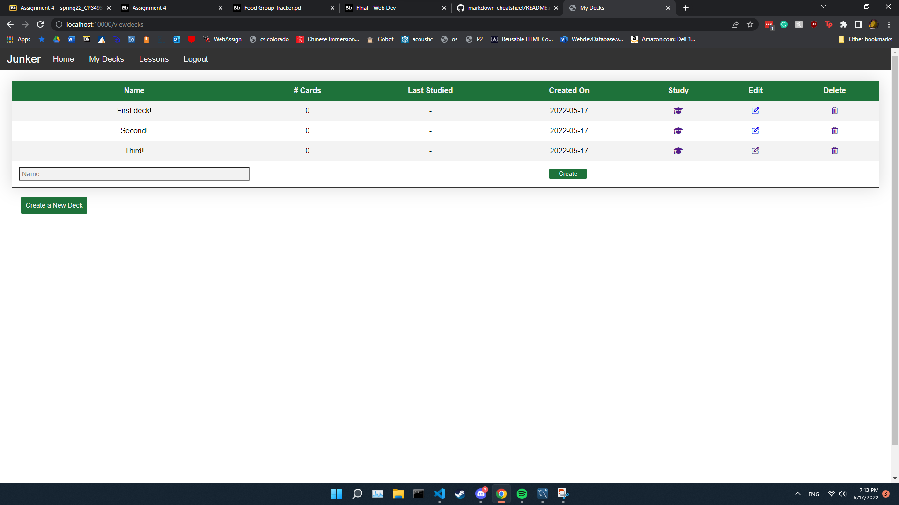
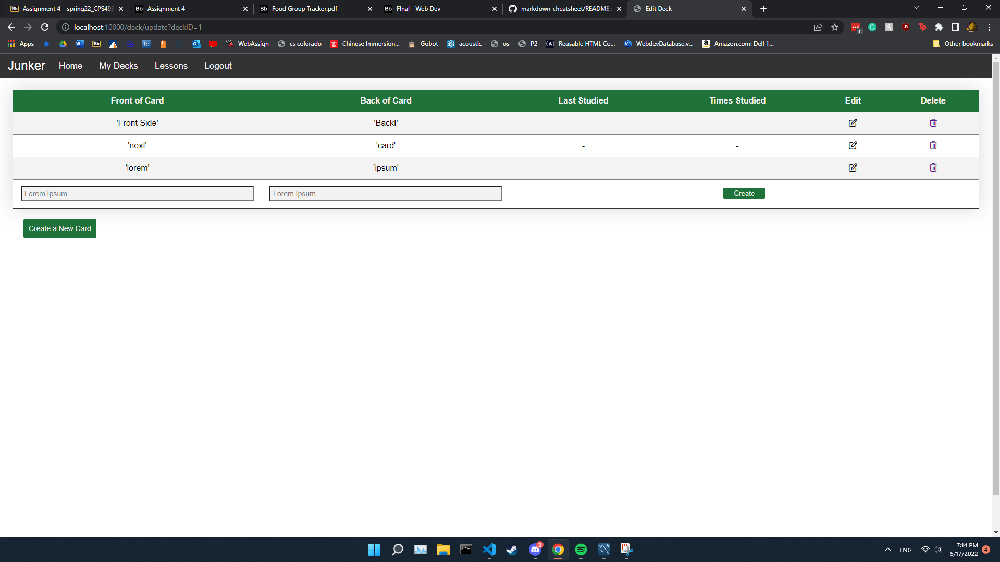
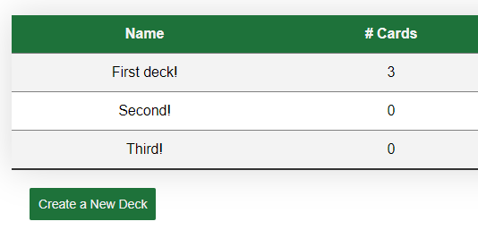
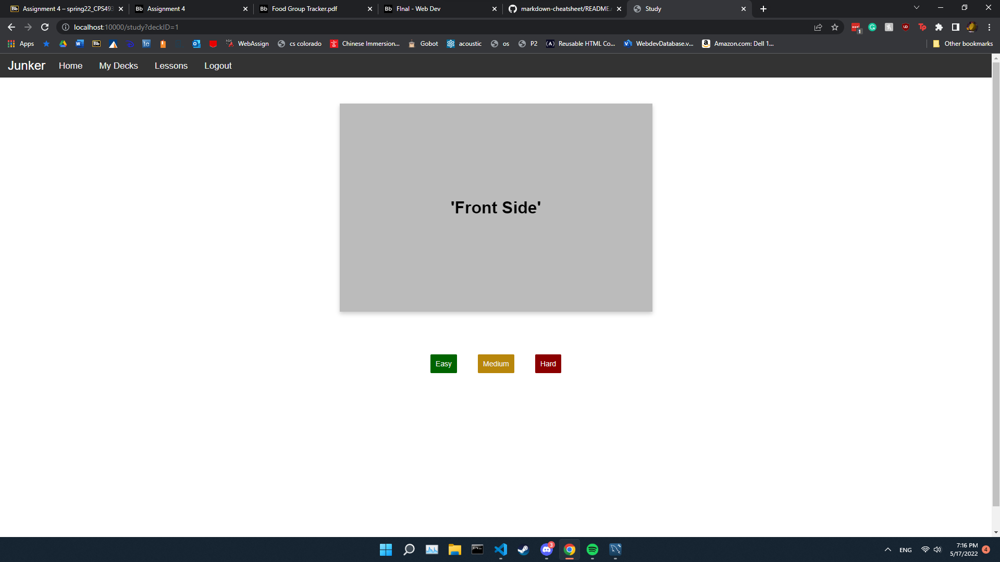
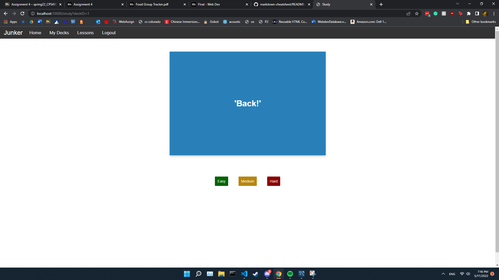
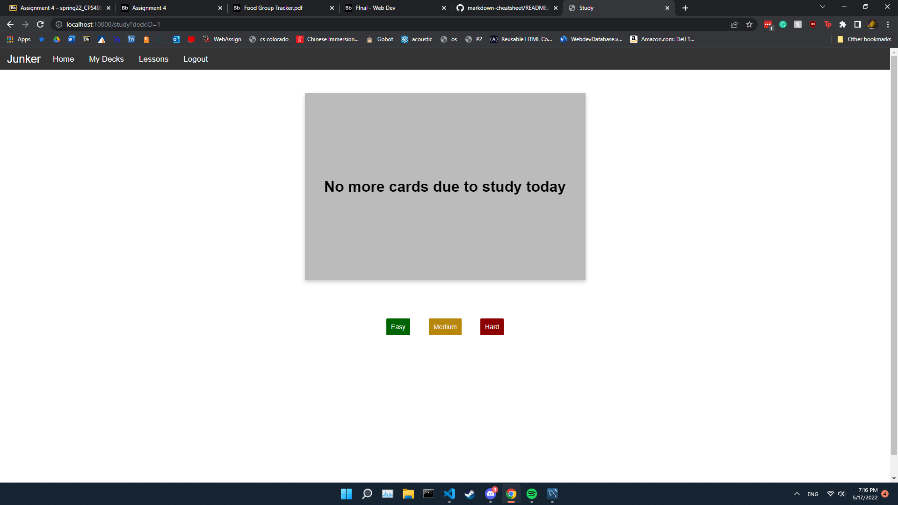

# Web Development Semester Project

## Description of your Web Application and the capabilities of it. Be as detailed as possible; What can a user do? Is your app finished? What do you want to add in the future?

The idea for this app is to be a study tool for people to use for whatever topics they want to learn. All of the lessons and cards are completely user generated and the lessons can be shared between users.

There are two features for studying with; flashcards and lessons. At the moment, a solid version of both are up and running. 

The flashcard system has a very simple spaced-repetition algorithm to schedule the next time that a card must be studied and keeps this value in the database so only the cards that need to be studied will be pulled out when queried. 

As for the lessons, the basic idea is as follows: any person can create a lesson (and edit/delete it of course) that everyone on the website can ONLY read. In the future, I would like to add a comment / rating system so that users can get feedbacks on their lessons and see which lessons may not be worth reading. I would also like to add a filter-by-topic system.

Something else that I would change in the future is just the general design. I know I am not the best digital designer, so I would like to give it a better look than 'default html styles'

Also figuring out something to put on the home pages could be good...

Either way I will continue to work on this, because even if I am the only one who uses it, it still functions as a good flashcard / note app. It is definitely rough, but it at least meets all of the CRUD / REST requirements that we went over.

As for the file structure of the project, I split up the models into their own folders, but I put all of the routes/endpoints into their own file in the endpoints folder just so I could stop tabbing through dozens of files at a time (I realize this is not best practice but it helped with my productivity I believe).

All frontend javascript can be found in the public/classes folder. HTML components are in the public/components folder. All pages are in the public/pages folder.

--------------
## Indicate any bugs or issues you have with your project currently.

At the moment (at least as far as I know), there is only one bug that I am aware of. When entering strings into the database there are surrounding single quotes ( ' ) that i had a hard time getting rid of. This isn't necessarily something that changes the functionality of the project but it is something I will fix to make everything look better.

--------------
## List of all technologies/frameworks/programming languages/etc used. 
### Frontend
>* Express
>* heroicons
>* javascript
>* fetch
>* Quill (text editor)

### Backend
>* Node
>* MySQL

-----------------
## Include a screenshot of your finished ERD. You MUST have made necessary changes indicated from my feedback on assignment 4. If you leave it as is without needed changes, you will lose points. Briefly explain the purpose of each entity.

A USER may Write as many LESSONS as they want. However, a LESSON is written by a single USER.

A USER may create as many DECKS as they want. However, a DECK belongs to only one USER.

A DECK may hold and is linked to any number of CARDS. However, each CARD may only belong to one DECK.

The setup of my database is fairly simple as there are only 2 features that need data storage. 

The USER entity is simply a user's account values. Because we do not need any user data for them to use the app, there is no need for us to keep it; all we need is their username and password really.

The LESSON entity is used to store the data needed for reading, writing, and updating lessons. The title is self explanatory, and the body is simply the storage-safe html generated from the wysiwyg editor during lesson creation and editing.

The DECK entity is really just a bucket with a title that serves as a reference to group cards together for studying.

The CARD entity is the main data part of the flashcard system, as it keeps the actual flashcard data for people to study with. It also contains all the information it needs to be able to do the spaced-repetition algorithm.

----------------
## Indicate how someone who downloads your project can use it. For most of you, it will include: npm install to download dependencies, using the command node index.js to run it, and setting up the environment variables for the database.

>1. Clone the git repository
>2. Download the latest version of MySQL community server and run through the setup
>3. run npm install to install the dependencies of the project
>4. at the root of the folder, if it is not present create a .env file with the following values:

    MYSQL_HOST="localhost"
    MYSQL_USERNAME="root"
    MYSQL_PSWD="Asdf123$"
    MYSQL_DB="webdev"

>5. navigate to the base of the repository and run the command 'npm start', this command will throw an error.
>6. run 'npm start' command again 2 more times (completely close the application if you are using nodemon), and this SHOULD start up cleanly (at least it has on my other computer)

---------------
# Some Photos of the App Working

Making a lesson:

Making some decks:

Adding some cards to our deck:

Studying some flashcards:

After studying our cards for the day:

## Old readme contents:
----------------------------------

#### General Idea:
Currently I am thinking about doing some sort of study / language learning app. I don't know if you know Anki at all (spaced repetition study app), but I would want to do some sort of web-based version of that combined with a couple of the prebuilt lesson components like duolingo.

I have no idea what to call it so for now I'll call it "Junker"

# ASSIGNMENT 5
For this assignment, there were a lot of functionalities that depended on the database being present. However, I believe that I have set up a good baseline of some reuseable components that will make setting up any future pages quite easy.

Navbar component cant be found in loggedNav.js
user class can be found in user.js inside the classes folder
many other helper functions and basic framework features are scattered around the repository

# ASSIGNMENT 3
The login and registration pages can be found either in src/server/public/pages or can be viewed by running the application and going to localhost:10000 and clicking on the login button. If you want to see some of the custom html elements that I used, see src/server/public/components. Styles are in src/server/public/styles.

I forgot to mention, but to run the server use 'npm run start'

